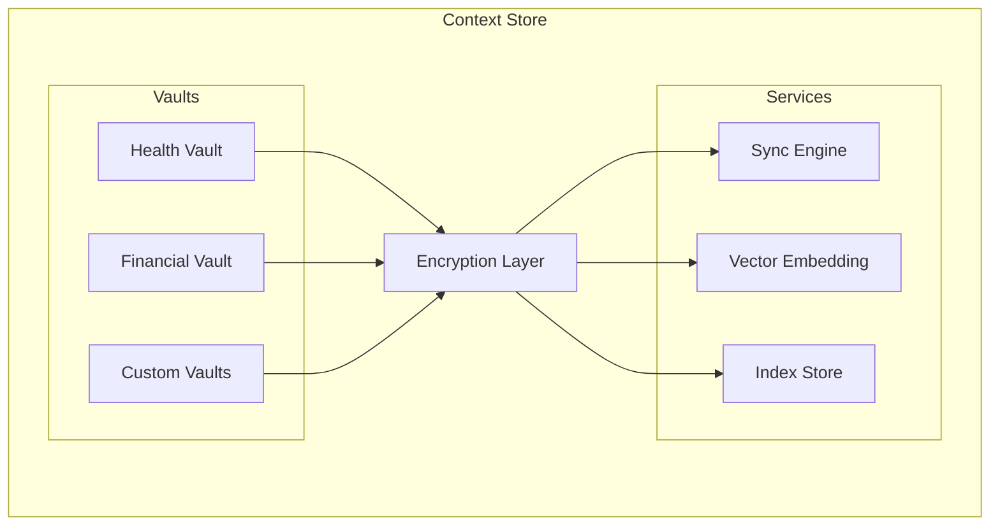

# PCI Context Store

Layer 1: Encrypted local-first data storage with CRDT sync for Personal Context Infrastructure.

## Overview

The Context Store provides:

- **Encrypted Vaults** - AES-256-GCM encryption at rest
- **CRDT Sync** - Conflict-free replication across devices
- **Vector Embeddings** - Semantic search over personal context
- **Local-First** - Data stays on your devices

## Installation

```bash
pnpm add pci-context-store
```

## Quick Start

```typescript
import { ContextStore, Vault } from "pci-context-store";

// Initialize the context store
const store = new ContextStore({
  encryption: {
    algorithm: "aes-256-gcm",
  },
});

// Create a vault for health data
const healthVault = await store.createVault("health");

// Store encrypted data
await healthVault.put("allergies", {
  items: ["penicillin", "peanuts"],
  lastUpdated: new Date(),
});

// Retrieve and decrypt
const allergies = await healthVault.get("allergies");
```

## Architecture



## Current Status

- [x] AES-256-GCM encryption at rest (Node.js crypto)
- [x] PBKDF2 key derivation (100k iterations)
- [x] In-memory vault storage with encryption
- [x] Basic vault CRUD operations
- [ ] Jazz CRDT integration (see Roadmap)
- [ ] Vector embeddings for semantic search
- [ ] Persistent storage

## Roadmap

### TODO: Jazz CRDT Integration

The context store will use [Jazz](https://jazz.tools) for CRDT-based sync. Jazz is MIT licensed and can be self-hosted (aligns with PCI's "Community Cloud" philosophy).

**Phase 1: Local-only Jazz (no network)**
- Replace in-memory Map with Jazz CoMaps
- Define vault schemas using `co.map()` with Zod validators
- Use `PureJSCrypto` from cojson for local account creation
- No cloud account required, `peers: []`

**Phase 2: Peer-to-peer sync**
- Add self-hosted Jazz sync server option
- Enable device-to-device sync via WebSocket peers
- Integrate with community node infrastructure

**Phase 3: Full integration**
- Vector embeddings stored in CoMaps
- Cross-device semantic search
- Offline-first with eventual consistency

### TODO: Vector Embeddings

- Integrate local embedding model (e.g., ONNX runtime)
- Store embeddings alongside encrypted data
- Enable semantic search over personal context

### TODO: Persistent Storage

- File-based persistence for encrypted vault data
- Export/import functionality
- Backup and recovery

## Development

```bash
# Install dependencies
pnpm install

# Run tests
pnpm test

# Build
pnpm build

# Type check
pnpm lint
```

## Related Packages

- [pci-spec](https://github.com/peteski22/pci-spec) - S-PAL schema and protocols
- [pci-agent](https://github.com/peteski22/pci-agent) - Layer 2: Personal Agent
- [pci-contracts](https://github.com/peteski22/pci-contracts) - Layer 3: Smart Contracts
- [pci-zkp](https://github.com/peteski22/pci-zkp) - Layer 4: Zero-Knowledge Proofs

## License

Apache 2.0
