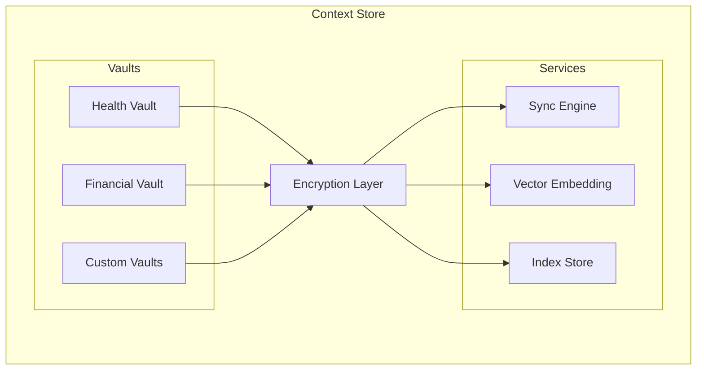

# PCI Context Store

Layer 1: Encrypted local-first data storage with CRDT sync for Personal Context Infrastructure.

## Overview

The Context Store provides:

- **Encrypted Vaults** - AES-256-GCM encryption at rest
- **CRDT Sync** - Conflict-free replication across devices
- **Vector Embeddings** - Semantic search over personal context
- **Local-First** - Data stays on your devices

## Installation

```bash
pnpm add pci-context-store
```

## Quick Start

```typescript
import { ContextStore, Vault } from "pci-context-store";

// Initialize the context store
const store = new ContextStore({
  encryption: {
    algorithm: "aes-256-gcm",
  },
});

// Create a vault for health data
const healthVault = await store.createVault("health");

// Store encrypted data
await healthVault.put("allergies", {
  items: ["penicillin", "peanuts"],
  lastUpdated: new Date(),
});

// Retrieve and decrypt
const allergies = await healthVault.get("allergies");
```

## Architecture



## Current Status

- [x] AES-256-GCM encryption at rest (Node.js crypto)
- [x] PBKDF2 key derivation (100k iterations)
- [x] In-memory vault storage with encryption
- [x] SQLite persistent storage (better-sqlite3)
- [x] Basic vault CRUD operations
- [x] Vector search with sqlite-vec
- [ ] Y.js CRDT sync (see Roadmap)

## Storage Options

### In-Memory (default)
```typescript
const vault = new EncryptedVault({
  name: "my-vault",
  storage: { type: "memory" },
});
```

### SQLite Persistence
```typescript
const vault = new EncryptedVault({
  name: "my-vault",
  storage: {
    type: "sqlite",
    path: "./data/my-vault.db"
  },
});
```

## Vector Search

Use `SQLiteVectorStore` for semantic similarity search with sqlite-vec:

```typescript
import { SQLiteVectorStore } from "pci-context-store";

const vectorStore = new SQLiteVectorStore({
  path: ":memory:",
  dimensions: 384,  // e.g., all-MiniLM-L6-v2
  distanceMetric: "cosine",
});

// Add embeddings
await vectorStore.add("doc1", embedding, { source: "notes" });

// Search for similar
const results = await vectorStore.search(queryEmbedding, 10);
```

## Roadmap

### TODO: Y.js CRDT Sync

Based on our research, we're using [Y.js](https://github.com/yjs/yjs) for CRDT-based sync (battle-tested, 65KB, 5+ years of production use in JupyterLab, Serenity Notes, etc.).

**Phase 1: Local-only**
- Wrap vault data in Y.Doc
- Persist Y.Doc state alongside SQLite

**Phase 2: Peer-to-peer sync**
- Add y-websocket server for self-hosted sync
- Enable device-to-device sync via WebSocket
- Integrate with community node infrastructure

### TODO: Embedding Model Integration

- Integrate local embedding model (e.g., transformers.js with ONNX)
- Auto-embed vault content on save
- Enable semantic search over personal context

## Development

```bash
# Install dependencies
pnpm install

# Run tests
pnpm test

# Build
pnpm build

# Type check
pnpm lint
```

## Related Packages

- [pci-spec](https://github.com/peteski22/pci-spec) - S-PAL schema and protocols
- [pci-agent](https://github.com/peteski22/pci-agent) - Layer 2: Personal Agent
- [pci-contracts](https://github.com/peteski22/pci-contracts) - Layer 3: Smart Contracts
- [pci-zkp](https://github.com/peteski22/pci-zkp) - Layer 4: Zero-Knowledge Proofs

## License

Apache 2.0
